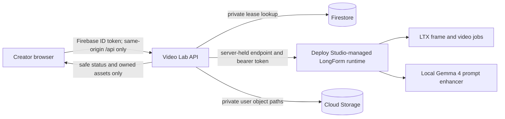

# Video Lab public runtime readiness

Audit date: 2026-08-01
Video Lab base revision audited: `e69c5cf060f397a733f7f4c9980945994ffc499e` on `main`
Deploy Studio revision audited: `81decc8da3bc7191aa2c6bfce961d0398f6c52a1` on `main`

## Product boundary

Video Lab owns identity, projects, the approachable storyboard experience, job ownership and same-origin delivery. Deploy Studio owns runtime provisioning, credentials, GPU selection, readiness, recovery and lifecycle. The LongForm runtime owns Gemma-assisted prompt planning, frame jobs and LTX video execution. Payment remains behind the existing server-side entitlement boundary and is not implemented here.

The browser never selects an upstream URL and never receives a runtime origin, provider hostname, access token, runtime job identifier or storage object path. Hiding a field in the interface is not treated as a security boundary.

## End-to-end data flow

1. Firebase Authentication establishes a user identity. Production API requests verify the Firebase ID token; the deterministic token shortcut exists only outside production.
2. The browser creates and edits owner-scoped projects through Video Lab. IndexedDB preserves selected `File` objects, while the media-free project, opaque frame-generation IDs and accepted scene-generation IDs are saved through `/api/v1/storyboards/projects/...` for restart recovery.
3. `/api/v1/storyboards/enhance` validates shot count, order, duration and mode, then calls Deploy Studio's local Gemma enhancer using server-only configuration. The response is schema checked again before it reaches the browser.
4. Frame or video submission creates a generation, an idempotency record, a per-user active-job lock and a durable queue record in one Firestore transaction.
5. A token-protected internal worker claims a bounded lease and calls only the allow-listed runtime origin published by Deploy Studio. Expired leases can be reclaimed after a process failure.
6. The API polls progress, stores safe state and copies completed frame/video bytes into a user-owned private object path.
7. The browser retrieves status and output through owned Video Lab API routes. It cannot read internal Firestore generation or queue documents directly.

## Security repairs completed

- Removed the browser-side paid Gemini fallback. Prompt assistance now uses the existing local Gemma path or fails honestly without replacing user text.
- Added strict production runtime-origin validation: HTTPS, origin-only URLs, explicit allow-list support, and rejection of loopback, private, link-local and unique-local targets.
- Rejected upstream redirects and cross-origin artifact URLs in the runtime adapter.
- Replaced direct browser/runtime traffic with authenticated same-origin API routes.
- Removed the public queue-drain endpoint. Production processing requires a server-held worker token; the local development route is not registered in production.
- Added production lease-expiry checks and removed runtime instance identifiers from public status.
- Added strict CORS, security headers, correlation IDs, request limits and generation-specific rate limits.
- Added safe error translation. Public failures contain a trace ID and stable classification, not raw stack traces or infrastructure details.
- Made admin navigation conditional on the verified server role and added a route guard. Admin endpoints continue to enforce authorisation server-side.
- Persisted pause/stop controls across API instances and recorded safe server-side audit events for runtime and credit-admin actions.
- Moved uploads behind the API. Direct Cloud Storage client access is denied.
- Denied direct browser reads of generations, assets, wallet, queue, idempotency, active-job, metrics and runtime documents.
- Enforced user ownership for drafts, uploads, generations, jobs and downloads.
- Added owner-scoped multi-project CRUD, private project switching and deletion scheduling; direct Firestore access remains denied.
- Added secure accepted-scene assembly: the browser supplies only owned Video Lab generation IDs, while the API resolves private runtime job IDs immediately before dispatch.
- Added stable runtime idempotency keys so a queue lease retry cannot silently duplicate paid LongForm work.
- Constrained storyboard projects to an allow-list, 24 shots, 512 KiB and no embedded base64 media.
- Added transactional production idempotency, one-active-job-per-user enforcement, queue capacity, FIFO ordering and reclaimable worker leases. Each protected worker invocation processes one claimed item, so a large backlog cannot hold one HTTP request open for multiple paid generations.
- Pinned application and tool dependencies. Firebase Admin is pinned to compatible 13.x for the selected Functions SDK.
- Upgraded the declarative SPA from vulnerable `react-router-dom` 6.30.4 to `react-router` 8.3.0, pinned transitive `uuid` to 11.1.1, and retained the patched URL/XML parser overrides. `pnpm audit --prod --audit-level moderate` reports no known production vulnerabilities.

## Threat model and residual risk

| Threat                       | Control                                                                                                        | Residual status                                                                                              |
| ---------------------------- | -------------------------------------------------------------------------------------------------------------- | ------------------------------------------------------------------------------------------------------------ |
| Runtime URL/token disclosure | Server-only discovery and adapter; public response projection; direct database reads denied                    | Browser acceptance and deployed bundle inspection still required                                             |
| SSRF                         | Origin-only URL parser, private-network rejection, explicit production allow-list, redirect rejection          | DNS rebinding and egress firewall policy require deployment-layer validation                                 |
| Cross-user IDOR              | Every project, draft, upload, accepted clip, generation and download is resolved against the authenticated UID | Local multi-user contract tests pass; Firebase emulator/deployed acceptance remains required                 |
| Duplicate or stranded jobs   | Transactional idempotency, active lock, durable queue and reclaimable lease                                    | A deployed worker scheduler and Firestore index acceptance are still required                                |
| Prompt/XSS injection         | React text rendering, bounded text, structured Gemma contract; LLM has no privileged controls                  | A dedicated content-security policy and adversarial browser pass remain release gates                        |
| Upload abuse                 | Image MIME allow-list, expected-size check, 10 MiB limit, generated object path                                | Content sniffing/malware scanning should be added before broad public uploads                                |
| Resource exhaustion          | Body limits, storyboard/scene limits, global queue cap, per-user active limit, fixed-window rate limits        | In-memory rate limits are per instance; production should use an edge/distributed limiter                    |
| Secret leakage in logs       | No prompts or tokens logged; errors projected to class/trace                                                   | Production log sink and retention policy need review                                                         |
| Runtime compromise           | No browser-selected origin; LongForm behind Deploy Studio                                                      | Runtime network egress, container SBOM and image-vulnerability acceptance remain external gates              |
| Dependency advisories        | Exact lockfile, patched Vite/React Router/transitive parsers/UUID and moderate-severity audit gate             | Production audit reports no known vulnerabilities; repeat the audit at release because advisory data changes |

Automated tests do not establish that the product is secure. The remaining deployment controls above must be validated in the real Firebase and Deploy Studio environment.

## Operational model

Recommended initial 24/7 architecture:

- Always on: static Video Lab frontend, low-cost application API, Firebase Auth, Firestore metadata/queue, private object storage and lightweight monitoring.
- On demand: one Deploy Studio-managed LongForm GPU worker that scales from zero. Many authenticated users may submit independently; Video Lab keeps their work in an owner-scoped durable FIFO queue while the VRAM-intensive worker renders one job at a time.
- Peak periods: optionally keep one pre-warmed worker during measured demand windows. Do not maintain a permanent GPU before traffic data justifies its idle cost.
- Growth: move to a small warm pool only after queue latency and concurrent demand exceed the cold-start service target. True simultaneous rendering requires multiple private runtime leases; increasing `WORKER_CONCURRENCY` inside one GPU container is not a safe substitute.

The current clean LongForm appliance has previously required roughly 19 minutes to become model-ready. That makes pure scale-to-zero cheapest but not yet ideal for interactive use. A hybrid scheduled warm window is the recommended launch compromise.

Lambda's [official on-demand table](https://lambda.ai/instances) checked on 2026-08-01 lists a single 80 GB H100 PCIe at USD 3.29/hour, and its [billing documentation](https://docs.lambda.ai/public-cloud/billing/) says on-demand use is billed by the minute after health checks. At that rate, continuously warming one worker is about USD 2,401.70 per 730-hour month before tax; an eight-hour daily warm window is about USD 789.60 per 30-day month. The proposed acceptance test should reserve 45–60 minutes, approximately USD 2.47–3.29 before tax. The launch request must still show and confirm the provider's live price because pricing and availability can change.

## Release gates

1. Repository owner must add an explicit licence; no licence file exists in Video Lab.
2. Deploy Firestore indexes and verify transactional queue behaviour against the emulator and staging project.
3. Configure a production allow-list, worker token, Deploy Studio enhancer token, runtime discovery lease and secret rotation procedure.
4. Validate the Firebase Hosting CSP against the production authentication flow and add a distributed/edge rate limiter.
5. Run desktop, mobile, keyboard and two-user browser acceptance against Firebase emulators or staging.
6. Run one approved temporary GPU test through the Video Lab gateway, including Gemma, both frame edges, one short video, restart recovery and zero-instance confirmation.
7. Produce and inspect SBOM/vulnerability results for the candidate Video Lab and LongForm images.
8. Decide retention/deletion policy for prompts, frames, videos, idempotency records and completed queue records.
9. Continue the route-level split beyond the 59.4 KiB LongForm chunk; the remaining Firebase/auth/account/admin shell is about 1,006.7 KiB minified and still triggers Vite's 500 KiB warning.
10. Integrate the real server-side entitlement provider without trusting browser state. Payment work remains out of scope.
11. Run the approved real-runtime accepted-scene assembly and provider-replacement persistence test; assembly still depends on the active worker retaining its accepted scene outputs.

No production image, DNS, payment, deployment or paid provider change was made during this audit.
